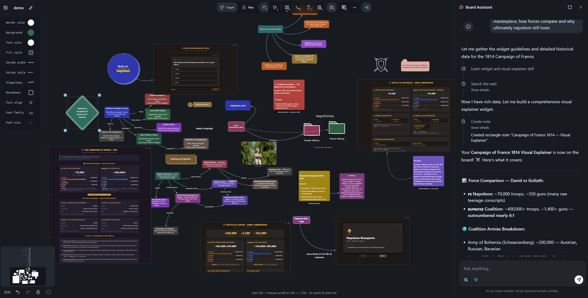

# Dim0 Landing Page

Landing page for [Dim0](https://dim0.net), the agent-native thinking canvas.



## About

This repo contains the marketing site for Dim0.

Dim0 is a thinking canvas where notes, documents, code, widgets, and board-aware AI agents work together on one surface. The landing page is built to explain that product clearly, show the app visually, and direct people to:

- the cloud app at `https://app.dim0.net`
- the main site at `https://dim0.net`
- the open-source product repo at `https://github.com/vcmf/dim0`

## Stack

- Next.js
- React
- TypeScript
- Tailwind CSS v4

## Local Development

Install dependencies and start the dev server:

```bash
npm install
npm run dev
```

Then open `http://localhost:3000`.

## Scripts

```bash
npm run dev
npm run build
npm run start
npm run lint
```
